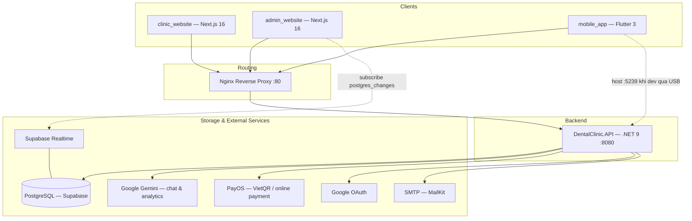

# 🏛️ Kiến trúc Hệ thống (System Architecture)

> Cập nhật: 2026-08-07 — nội dung dưới đây đã được đối chiếu trực tiếp với source code.

Hệ thống quản lý phòng khám nha khoa được thiết kế dưới dạng **Monorepo** chứa 4 phân hệ ứng dụng phục vụ các nhóm người dùng khác nhau. Tất cả client giao tiếp với backend qua **HTTP/REST**, đi qua một **Nginx reverse proxy** duy nhất.

---

## 🗺️ Tổng quan Hệ thống (System Overview)



**Lưu ý về Realtime:** `admin_website` subscribe **trực tiếp** vào Supabase Realtime (không qua API) cho các bảng `ActivityLogs` và `Notifications`, chỉ lắng nghe sự kiện `INSERT`. Đây là kênh giao tiếp duy nhất mà client không đi qua Nginx/API.

---

## 🚦 Định tuyến qua Nginx (`nginx/nginx.conf`)

| Path | Upstream | Ghi chú |
| :--- | :--- | :--- |
| `/api/` | `api:8080` | **Không** strip prefix — mọi controller khai báo `[Route("api/xxx")]` |
| `/uploads/` | `api:8080` | File tĩnh do API lưu (`UseStaticFiles()`, không có tiền tố `/api`) |
| `/admin`, `/staff`, `/dentist`, `/owner`, `/auth` | `admin_website:3000` | Regex `^/(admin\|staff\|dentist\|owner\|auth)(/\|$)` — admin không dùng `basePath` |
| `/` (catch-all) | `clinic_website:3000` | Đặt cuối cùng |

Giới hạn body `20M`; timeout `/api/` nới lên `read 120s` cho AI chat / upload file.
Ngoài Nginx, service `api` còn expose thẳng cổng host **`5239`** để mobile app dùng chung một cổng cố định (`adb reverse tcp:5239 tcp:5239`) dù API chạy bằng Docker hay `dotnet run`.

---

## 🗂️ Cấu trúc Chi tiết từng phân hệ

### 1. Backend API (`apps/api`)

Thiết kế theo **Clean Architecture**, tách thành **4 project .NET riêng biệt** (không phải 4 thư mục trong 1 project) — ranh giới lớp được compiler cưỡng chế, không chỉ là quy ước:

| Project | File | Tham chiếu |
| :--- | :--- | :--- |
| Domain | `src/Domain/Domain.csproj` | *(không có dependency nào — kể cả NuGet)* |
| Application | `src/Application/Application.csproj` | → Domain |
| Infrastructure | `src/Infrastructure/Infrastructure.csproj` | → Application, Domain |
| Presentation | `DentalClinic.API.csproj` (Web SDK) | → cả 3 project trên |

#### **Sơ đồ phụ thuộc (Dependency Rule):**
```
Presentation (API) ➔ Infrastructure ➔ Application ➔ Domain
```
*Luồng phụ thuộc luôn hướng vào trong. Lớp bên trong không bao giờ biết đến lớp bên ngoài.*

#### **Vai trò của từng lớp:**

* **Domain (Lớp lõi nghiệp vụ)** — `src/Domain/`
  * `Entities/` — 34 entity (User, Patient, Appointment, Invoice, TreatmentPlan, Prescription, ActivityLog, Notification…)
  * `Enums/` — 10 file CLR enum (`UserRole`, `AppointmentStatus`, `PaymentMethod`/`PaymentStatus`/`PaymentGateway`/`TransactionStatus`, `LeaveStatus`, `PayrollStatus`…)
  * `Constants/` — hằng số **string** dùng cho `switch`/so sánh: `ActivityAction`, `ActivityModule`, `ActivityStatus`, `NotificationType` + `NotificationPriority`, `InventoryConstants`
  * `Interfaces/Repositories/` — 34 interface repository
  * `Interfaces/Services/` — 10 interface service hạ tầng (`IJwtService`, `IEmailService`, `ICurrentUserService`, `IActivityLogService`, `INotificationService`, `IFileStorageService`, `IGoogleAuthService`, `IAiChatService`, `IPaymentGatewayService`, `IPaymentConfirmationService`)
  * `Exceptions/` — `NotFoundException`, `ValidationException`, `ConflictException`, `ForbiddenException`
  * *Quy tắc:* **Tuyệt đối không** phụ thuộc thư viện/framework bên ngoài.

* **Application (Lớp điều phối logic)** — `src/Application/`
  * `UseCases/` — ~154 handler **MediatR** (`IRequestHandler<TRequest, TResponse>`), tổ chức theo module: `Auth`, `Booking`, `Appointments`, `ClinicalRecords`, `Invoices`, `Payments`, `Inventory`, `Payrolls`, `Queue`, `Dashboard`, `AiAssist`, `Chat`…
  * `DTOs/` — request/response record, gom theo module
  * `Validators/` — FluentValidation (Auth, Invoices, Queue)
  * `Behaviors/ValidationBehavior.cs` — MediatR pipeline behavior chạy mọi `IValidator<TRequest>` **trước** handler, gom lỗi thành `ValidationException`
  * `Interfaces/` — interface của các **query-service đọc tổng hợp đa entity** (`IDashboardQueryService`, `IStaffDashboardQueryService`, `IDentistDashboardQueryService`) — khác repository CRUD nên đặt ở Application, không ở Domain
  * `DependencyInjection/ApplicationServiceExtensions.cs` — `AddApplication()`: đăng ký MediatR (quét chính assembly Application) + open behavior + validator
  * *Quy tắc:* Chỉ phụ thuộc `Domain`. Ngoại lệ có chủ đích: `BCrypt.Net-Next` được gọi trực tiếp trong handler Auth/Staff — hash thuần, không I/O, không coi là vi phạm ranh giới.

* **Infrastructure (Lớp hạ tầng)** — `src/Infrastructure/`
  * `Persistence/AppDbContext.cs` — EF Core; đồng thời **implement `IUnitOfWork`** (đăng ký resolve về đúng instance scoped của request)
  * `Persistence/Configurations/`, `Persistence/Migrations/`, `Persistence/DataSeeder.cs`
  * `Persistence/Repositories/` — implement 34 repository interface
  * `Services/` — `JwtService`, `EmailService` (MailKit), `GeminiChatService` + `GeminiReplyParser`, `GoogleAuthService`, `PayOSGatewayService` + `PaymentGatewayResolver`, `LocalFileStorageService`, `ActivityLogService`, `NotificationService`, `CurrentUserService`, 3 `*DashboardQueryService`
  * `Settings/` — `JwtSettings`, `EmailSettings`, `PayOSSettings`, `GeminiSettings`, `GoogleAuthSettings`
  * `Extensions/InfrastructureServiceExtensions.cs` — `AddInfrastructure()`: DbContext, settings binding, toàn bộ repository/service
  * *Ghi chú:* dùng `FrameworkReference Microsoft.AspNetCore.App` (cần `HttpContext` cho `CurrentUserService`) chứ **không** dùng Web SDK.

* **Presentation / API (Lớp giao tiếp)** — `apps/api/` + `src/Presentation/`
  * `Controllers/` — **31 controller mỏng**, chỉ nhận request → `ISender.Send(...)` → trả response
  * `Middlewares/ExceptionMiddleware.cs` — map domain exception → HTTP status thống nhất
  * `Middlewares/AccountStatusMiddleware.cs` — chặn request của tài khoản bị khoá (chạy **sau** Authentication, **trước** Authorization)
  * `Program.cs` — cấu hình DI, JWT, CORS, OpenAPI, auto-migrate + seed

#### **Pipeline request (`Program.cs`):**
```
ExceptionMiddleware → CORS → StaticFiles → [HttpsRedirection nếu !Development]
  → Authentication → AccountStatusMiddleware → Authorization → Controllers
  → ISender.Send() → ValidationBehavior → IRequestHandler → Repository/Service → AppDbContext
```
Khi khởi động, app tự chạy `db.Database.MigrateAsync()` + `DataSeeder.SeedAsync(db)`.

#### **Xử lý lỗi thống nhất:**
- `ExceptionMiddleware` chuyển exception của Domain thành response chuẩn.
- `ApiBehaviorOptions.InvalidModelStateResponseFactory` được ghi đè để lỗi model-binding trả về `{ title, status: 422 }` — cùng dạng với `ExceptionMiddleware`.

---

### 2. Frontend Websites (`apps/admin_website` & `apps/clinic_website`)

Cả hai đều dùng **Next.js 16.2.7 (App Router) + React 19.2.4 + TypeScript 5 + Tailwind CSS v4**. Không dùng thư viện state-management ngoài (Zustand/Redux) và không dùng Axios — state cục bộ bằng React hooks, gọi API bằng `fetch` bọc trong `lib/`.

#### `clinic_website` — Website giới thiệu (public, SEO-first)
```
src/
├── app/           # Route tiếng Việt: gioi-thieu, dich-vu, bac-si, bang-gia,
│                  # khuyen-mai, tin-tuc, huong-dan-su-dung
├── components/
│   ├── sections/  # Các section của trang landing
│   └── shared/
├── lib/           # api.ts (gọi từ Server Component), format.ts, listing.ts, serviceIcons.tsx
└── types/api.ts
```
> ⚠️ `lib/api.ts` **chỉ** được gọi từ Server Component (chạy bên trong container). Vì vậy `NEXT_PUBLIC_API_URL` của service này phải trỏ vào `http://api:8080/api` (tên service Docker), **không** dùng `localhost`.

#### `admin_website` — Hệ thống vận hành nội bộ
```
src/
├── app/
│   ├── auth/      # Đăng nhập nội bộ
│   ├── admin/     # Quản trị hệ thống
│   ├── owner/     # Chủ phòng khám — HR, duyệt nghỉ phép, báo cáo
│   ├── dentist/   # Bác sĩ — lịch, bệnh án, kê đơn
│   └── staff/     # Lễ tân — đặt lịch, hàng đợi, hoá đơn
├── components/shared/   # *Sidebar, *PageHeader, NotificationBell, ToothArchDiagram...
├── hooks/               # useRequireAdmin / useRequireOwner / useRequireDentist / useRequireStaff
└── lib/                 # apiClient.ts, supabaseClient.ts, roles.ts, shifts.ts, inventoryConstants.ts
```
- Mỗi role có **một cây route riêng**; guard phía client bằng hook `useRequire<Role>()`.
- `lib/apiClient.ts` tự ghép `"${API_URL}/api/xxx"` → biến `NEXT_PUBLIC_API_URL` truyền vào **không** được có sẵn `/api` (khác `clinic_website`).
- `lib/supabaseClient.ts` — chỉ dùng cho Realtime subscription, không dùng để đọc/ghi dữ liệu nghiệp vụ.

---

### 3. Mobile App (`apps/mobile_app`)

Ứng dụng bệnh nhân viết bằng **Flutter 3**, tổ chức theo kiến trúc **Feature-First**.

```
lib/
├── main.dart
├── app/           # app.dart, routers.dart (GoRouter), main_shell.dart, settings_manager.dart
├── core/
│   ├── constants/ # api_constants.dart (baseUrl động qua SettingsManager), app_colors.dart
│   ├── network/   # api_client.dart (Dio, gắn header Bearer)
│   └── utils/
└── features/      # appointment · auth · booking · home · payment · profile
    └── [feature]/
        ├── data/          # Models, Services gọi API
        └── presentation/  # Pages, Widgets
```

**Thư viện chính:** `go_router` (routing khai báo), `dio` (HTTP), `shared_preferences` (lưu token + trạng thái cục bộ), `google_sign_in` (+ `google_sign_in_web`), `url_launcher` (mở checkout PayOS), `flutter_svg`, `google_fonts`, `iconsax`, `image_picker`.

> **Thực trạng so với chuẩn Clean Architecture:** feature hiện chỉ có `data/` + `presentation/`, **chưa** tách tầng `domain/` (entities + use case + repository interface), và state được quản lý bằng `StatefulWidget`/`ValueNotifier` chứ chưa dùng Riverpod/BLoC. Đây là nợ kỹ thuật đã biết, không phải mô tả kiến trúc mục tiêu.

---

## 🔒 Cơ chế Bảo mật & Xác thực

### 1. Xác thực — JWT Bearer (chỉ access token)

- Đăng nhập qua `POST /api/auth/login` (bệnh nhân) hoặc `POST /api/auth/staff/login` (nội bộ); có thêm `POST /api/auth/google-login`.
- Server trả về **một access token** ký HS256. Thời hạn cấu hình ở `JwtSettings:ExpiryMinutes` — hiện là **150 phút**.
- **Chưa có cơ chế refresh token.** Không có endpoint `refresh-token`, không có entity `RefreshToken`/`UserSession`. Hết hạn ⇒ đăng nhập lại. (`POST /api/auth/logout` chỉ dọn phía client.)
- Validation bật đầy đủ `ValidateIssuer` / `ValidateAudience` / `ValidateLifetime` / `ValidateIssuerSigningKey`, `ClockSkew = 0`.

**Lưu token phía client:**

| Client | Nơi lưu |
| :--- | :--- |
| `admin_website` | `localStorage` (khi "ghi nhớ đăng nhập") hoặc `sessionStorage` — gửi qua header `Authorization: Bearer` |
| `mobile_app` | `SharedPreferences` — Dio gắn header `Authorization: Bearer` |

> ⚠️ Web đang lưu token trong Web Storage (đọc được bằng JS) chứ không phải HttpOnly cookie — đánh đổi có chủ đích vì API dùng Bearer thuần, nhưng cần lưu ý khi đánh giá rủi ro XSS.

### 2. Phân quyền — RBAC

5 role, định nghĩa tại `Domain/Enums/UserRole.cs`:

| Role | Phạm vi |
| :--- | :--- |
| `Admin` | Quản trị kỹ thuật/hệ thống |
| `Owner` | Chủ phòng khám — nhân sự, duyệt nghỉ phép, lương, báo cáo |
| `Dentist` | Bác sĩ — lịch làm việc, bệnh án, kê đơn |
| `Staff` | Lễ tân — đặt lịch, hàng đợi, hoá đơn, kho |
| `Patient` | Bệnh nhân — mobile app & tra cứu |

Kiểm tra ở tầng Presentation bằng attribute, ví dụ `[Authorize(Roles = "Admin,Owner")]`. Với dữ liệu thuộc sở hữu cá nhân (bệnh án, hoá đơn, hồ sơ người thân), handler còn kiểm tra quyền sở hữu qua `ICurrentUserService` + helper (`PatientAccessHelper`, `InvoiceQueryHelper`) — role đúng vẫn chưa đủ để đọc dữ liệu của người khác.

### 3. Các lớp bảo vệ khác

- `AccountStatusMiddleware` — chặn tài khoản bị vô hiệu hoá ngay sau khi xác thực token.
- **CORS** — dev: `AllowAnyOrigin` (Flutter web chạy port ngẫu nhiên); prod: chỉ các origin trong `AllowedOrigins`.
- **HTTPS redirect** — bật khi môi trường khác `Development`.
- `server_tokens off` + `client_max_body_size 20M` ở Nginx.
- **Audit trail** — `ActivityLogService` ghi log mọi hành động người dùng (fire-and-forget, nuốt exception để không làm hỏng luồng nghiệp vụ chính; ghi Warning khi log thất bại).

---

## 🧪 Kiểm thử

| Project | File test | Ghi chú |
| :--- | ---: | :--- |
| `tests/Domain.Tests` | 1 | Chỉ mới phủ `ActivityLog` |
| `tests/Application.Tests` | 79 | Unit test handler, mock repository/service |
| `tests/Infrastructure.Tests` | 67 | Integration-style, không mock DB |
| **Tổng** | **147** | **1.123 test case** (`dotnet test --list-tests`) |

**Stack:** NUnit 4 + NSubstitute + FluentAssertions
**Chạy:** `dotnet test DentalClinic.sln` từ `apps/api/`
**Quy tắc:** toàn bộ phải pass trước khi merge.

---

## ⚠️ Ghi chú vận hành

**`dotnet ef database update <target>`** — DB dev là Supabase Postgres **dùng chung**, không phải local disposable. Truyền một tên migration cũ làm target sẽ **revert toàn bộ** migration sau nó, không chỉ một cái. Luôn chạy `dotnet ef migrations list` ngay trước và xác nhận đúng target.

**`JwtSettings__Issuer` / `Audience` trong Docker** — hai giá trị này chỉ có trong `appsettings.Development.json`, bị bỏ qua khi `ASPNETCORE_ENVIRONMENT=Production`. `docker-compose.yml` phải set chúng qua biến môi trường, nếu không token sẽ được ký thiếu `iss`/`aud` và mọi request xác thực sau đó trả 401 "audience invalid".
