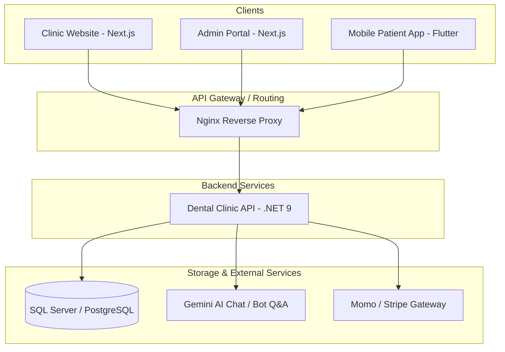

# 🏛️ Kiến trúc Hệ thống (System Architecture)

Hệ thống quản lý phòng khám nha khoa được thiết kế dưới dạng **Monorepo** chứa các phân hệ ứng dụng khác nhau để phục vụ các nhóm người dùng khác nhau. Tất cả giao tiếp qua giao thức HTTP/REST API.

---

## 🗺️ Tổng quan Hệ thống (System Overview)



---

## 🗂️ Cấu trúc Chi tiết từng phân hệ (Structure & Development Guidelines)

### 1. Backend API (`apps/api`)
Dự án Backend sử dụng thiết kế theo **Clean Architecture (Domain-Driven Design inspired)** để chia nhỏ trách nhiệm và cô lập logic nghiệp vụ khỏi các công nghệ bên ngoài.

#### **Sơ đồ phụ thuộc (Dependency Rule):**
```
Presentation (API) ➔ Infrastructure ➔ Application ➔ Domain
```
*Lưu ý: Luồng phụ thuộc luôn hướng vào trong. Lớp bên trong không bao giờ được biết đến lớp bên ngoài.*

#### **Vai trò của từng lớp (Layers):**

* **Domain (Lớp lõi nghiệp vụ):**
  * *Chứa:* Entities (Thực thể), Enums, Value Objects, Domain Exceptions, Interfaces.
  * *Quy tắc:* **Tuyệt đối không** phụ thuộc vào bất kỳ thư viện hay framework bên ngoài nào (ngoại trừ các thư viện hệ thống cơ bản).
* **Application (Lớp điều phối logic):**
  * *Chứa:* DTOs (Data Transfer Objects), Mappings (Mapster/AutoMapper), Validators (FluentValidation), Use Cases (MediatR Command/Query Handlers).
  * *Quy tắc:* Định nghĩa các hành vi nghiệp vụ của hệ thống dưới dạng các Use Case. Chỉ phụ thuộc vào lớp `Domain`.
* **Infrastructure (Lớp hạ tầng):**
  * *Chứa:* Database Context (EF Core), Data Migrations, Repositories Implementation, Mail Service, Payment Integration Service, AI API Wrapper.
  * *Quy tắc:* Thực thi các interface được khai báo ở lớp `Application` hoặc `Domain`. Lớp này xử lý các thao tác I/O thực tế.
* **Presentation / API (Lớp giao tiếp):**
  * *Chứa:* Controllers, Middlewares (Xử lý Exception toàn cục, Auth), DI Configurations, appsettings.json.
  * *Quy tắc:* Đóng vai trò là điểm tiếp nhận HTTP request và trả về HTTP response. Không xử lý trực tiếp logic nghiệp vụ mà chuyển tiếp cho `MediatR` tại lớp `Application`.

---

### 2. Frontends Website (`apps/admin_website` & `apps/clinic_website`)
Cả hai ứng dụng đều phát triển dựa trên **Next.js App Router (React 19 & Next.js 15/16)** cùng với **Tailwind CSS v4**.

#### **Quy tắc cấu trúc thư mục:**
* `/src/app/` — Quản lý routing dựa trên cấu trúc file.
  * *Marketing (Public Site):* Sử dụng Server Components cho các trang tĩnh như giới thiệu, dịch vụ để tối ưu SEO.
  * *Dashboard (Admin Site):* Thiết kế module hóa gồm: `/appointments`, `/patients`, `/inventory`, `/invoices`, `/dentists`.
* `/src/components/` — Các component tái sử dụng (Atomic Design).
  * `ui/`: Các element cơ bản (Button, Input, Dialog...)
  * `shared/`: Sidebar, Header, Layout components dùng chung.
* `/src/lib/` — Trình quản lý kết nối API, cấu hình các service client (Axios/Fetch).
* `/src/stores/` — Quản lý state toàn cục (Zustand hoặc React Context) - đặc biệt quan trọng ở admin portal.
* `/src/types/` — Định nghĩa tất cả các Type/Interface TypeScript dùng chung.

---

### 3. Mobile App (`apps/mobile_app`)
Ứng dụng di động dành cho bệnh nhân viết bằng **Flutter**, tổ chức theo kiến trúc **Feature-First + Clean Architecture** nhằm đảm bảo tính cô lập và dễ mở rộng.

#### **Qấu trúc thư mục lõi:**
* **`lib/app/`**: Chứa router (`routers.dart`), cấu hình định tuyến (GoRouter), và file gốc khởi tạo app (`app.dart`).
* **`lib/core/`**: Lưu trữ các hằng số (`constants/`), xử lý lỗi ngoại lệ (`errors/`), cấu hình API client (`network/`), và các hàm tiện ích (`utils/`).
* **`lib/shared/`**: Các widget giao diện chung (button, input, card của riêng app) và cấu hình giao diện `theme/`.
* **`lib/features/`**: Chia theo các tính năng độc lập. Cấu trúc chuẩn cho một feature gồm:
  ```text
  features/[feature_name]/
  ├── data/          # Datasources (Remote/Local), Models, Repositories Implementation
  ├── domain/        # Entities, Repositories Interface, Use Cases
  └── presentation/  # UI Pages, Custom Widgets, State Controller (Riverpod/BLoC)
  ```
  *Quy tắc phát triển: Các features không nên tham chiếu trực tiếp chéo nhau ở tầng presentation. Mọi giao tiếp chéo nếu có phải thông qua tầng domain.*

---

## 🔒 Cơ chế Bảo mật & Xác thực (Authentication & Security)

1. **Xác thực qua JWT (JSON Web Token):**
   * Người dùng đăng nhập qua API `/auth/login` trên Mobile hoặc Admin Web.
   * Server trả về `AccessToken` (hạn ngắn, ví dụ: 15 phút) và `RefreshToken` (hạn dài, ví dụ: 7 ngày, lưu vào HttpOnly Cookie đối với Web hoặc Secure Storage đối với Mobile).
2. **Phân quyền (RBAC - Role Based Access Control):**
   * Các quyền được phân định rõ ràng trên JWT Claim: `Admin`, `Dentist`, `Receptionist`, `Patient`.
   * Lớp Presentation trên API sẽ kiểm tra quyền hạn bằng attribute `[Authorize(Roles = "Dentist,Admin")]`.
