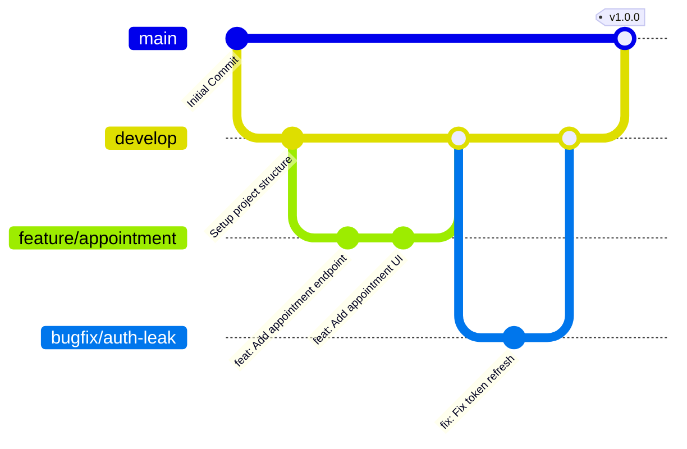

# 🌿 Quy trình Git & Phối hợp Phát triển (Git Workflow)

Tài liệu này quy định cách thức làm việc với Git, đặt tên nhánh, viết commit message và quy trình review code của nhóm nhằm đảm bảo chất lượng source code ổn định nhất.

---

## 🗺️ Nhánh chính trong Repository (Branch Strategy)

Dự án áp dụng mô hình phát triển rút gọn từ **Git Flow**:



1. **`main` (Nhánh Production):**
   * Chứa code ổn định nhất, sẵn sàng triển khai lên Production.
   * **Tuyệt đối không** commit trực tiếp lên nhánh `main`.
   * Code đưa vào `main` chỉ thông qua Pull Request (PR) từ nhánh `develop` hoặc các nhánh `hotfix/*` khẩn cấp.
2. **`develop` (Nhánh Tích hợp):**
   * Nhánh chính cho quá trình phát triển hàng ngày. Tất cả các tính năng mới đều được merge vào đây trước khi release.
3. **`feature/*` (Nhánh Tính năng):**
   * Dùng để phát triển các tính năng mới hoặc Use Case cụ thể.
   * Đặt tên theo cú pháp: `feature/ten-tinh-nang` hoặc `feature/ticket-id` (Ví dụ: `feature/appointment-booking`).
   * Tách ra từ `develop` và merge lại vào `develop`.
4. **`bugfix/*` & `hotfix/*` (Nhánh Sửa lỗi):**
   * `bugfix/*`: Dùng để sửa các lỗi phát sinh trong quá trình test trên môi trường staging (tách từ `develop`).
   * `hotfix/*`: Dùng để sửa các lỗi nghiêm trọng xảy ra trực tiếp trên Production (tách từ `main`).

---

## 📝 Quy tắc Đặt tên Commit (Conventional Commits)

Commit message cần viết ngắn gọn, rõ ràng bằng tiếng Anh hoặc tiếng Việt thống nhất theo chuẩn **Conventional Commits**:

Cú pháp chuẩn: `<type>(<scope>): <description>`

### Các loại Type phổ biến:
* `feat`: Thêm một tính năng mới (Ví dụ: `feat(api): add stripe payment integration`).
* `fix`: Sửa một lỗi (Ví dụ: `fix(mobile): fix overflow layout in booking page`).
* `docs`: Thay đổi tài liệu hướng dẫn (Ví dụ: `docs: update system architecture diagram`).
* `style`: Định dạng code (khoảng trắng, tab, dấu chấm phẩy - không ảnh hưởng tới logic chạy).
* `refactor`: Tái cấu trúc lại code mà không thay đổi tính năng hay sửa lỗi.
* `test`: Viết thêm unit test hoặc sửa code kiểm thử.
* `chore`: Các tác vụ nhỏ khác liên quan đến cấu hình build, package manager (Ví dụ: `chore: update npm packages`).

---

## 🔍 Quy trình Tạo và Duyệt Pull Request (PR Process)

Để đưa code từ nhánh của bạn vào nhánh chung (`develop` hoặc `main`), bạn cần thực hiện theo các bước sau:

### Bước 1: Đồng bộ hóa code mới nhất
Trước khi tạo PR, hãy pull code mới nhất từ nhánh đích về và giải quyết xung đột (conflict) nếu có ở máy local:
```bash
git checkout develop
git pull origin develop
git checkout feature/your-feature
git merge develop
# Giải quyết conflict (nếu có)
```

### Bước 2: Tạo Pull Request trên GitHub/GitLab
* Tiêu đề PR cần ghi rõ nội dung thay đổi.
* Trong phần mô tả PR, liệt kê ngắn gọn các việc đã thực hiện và gắn thẻ các Task liên quan.

### Bước 3: Đánh giá Code (Code Review Checklist)
Mỗi PR cần có ít nhất **1 thành viên khác trong nhóm** duyệt qua trước khi thực hiện merge. Người review sẽ kiểm tra:
- [ ] Code có chạy đúng theo đặc tả nghiệp vụ không?
- [ ] Code có tuân thủ đúng kiến trúc dự án (Clean Architecture đối với API, Feature-First đối với Mobile) không?
- [ ] Có bị rò rỉ bảo mật (hardcode mật khẩu, thiếu xác thực quyền hạn trên API) không?
- [ ] Code có sạch sẽ, dễ đọc, không thừa file thừa rác hay không?

---

## ⚙️ Các lệnh Git cơ bản thường dùng
* **Tạo nhánh mới và chuyển sang nhánh đó:**
  ```bash
  git checkout -b feature/appointment-booking
  ```
* **Lưu trạng thái tạm thời (khi cần chuyển nhánh gấp mà chưa muốn commit):**
  ```bash
  git stash
  # Lấy lại trạng thái sau đó:
  git stash pop
  ```
* **Xem lịch sử commit rút gọn:**
  ```bash
  git log --oneline -n 10
  ```
